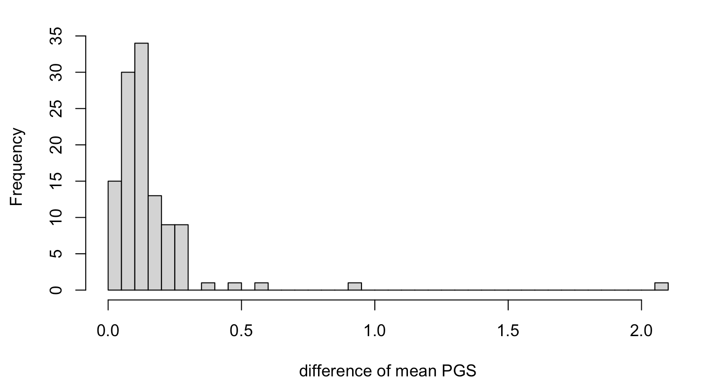
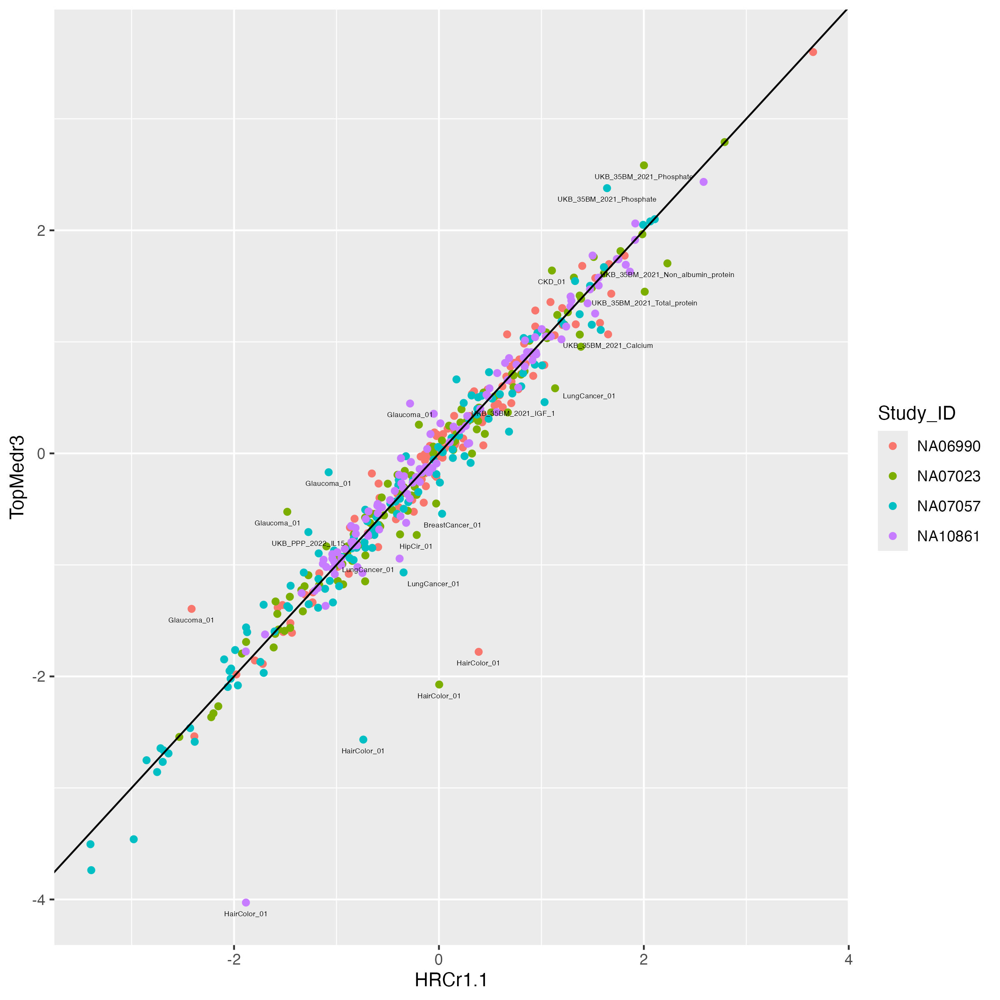
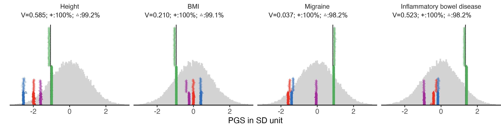
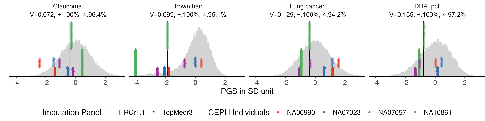
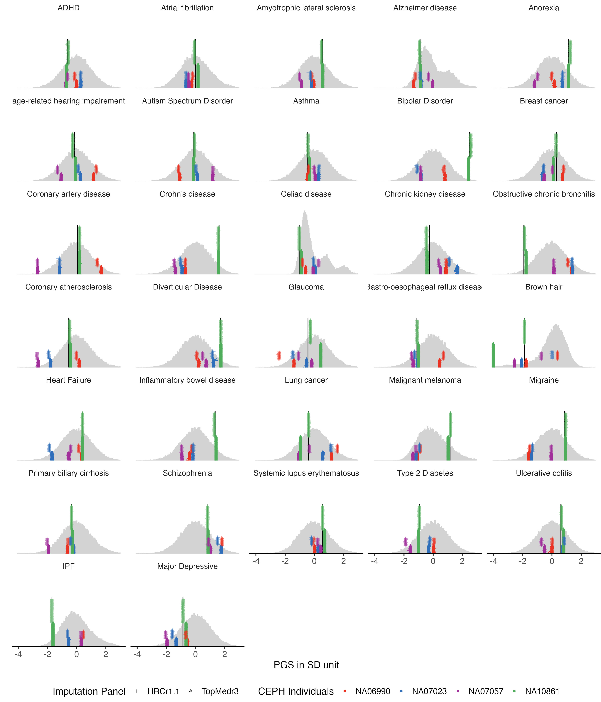
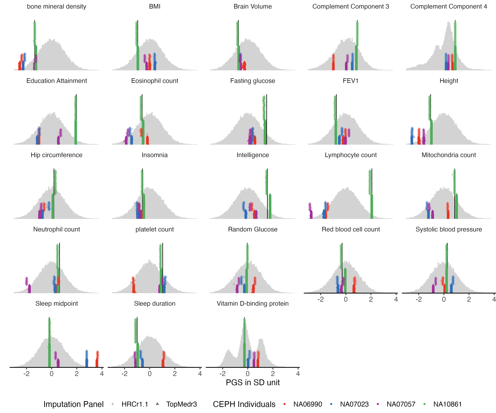
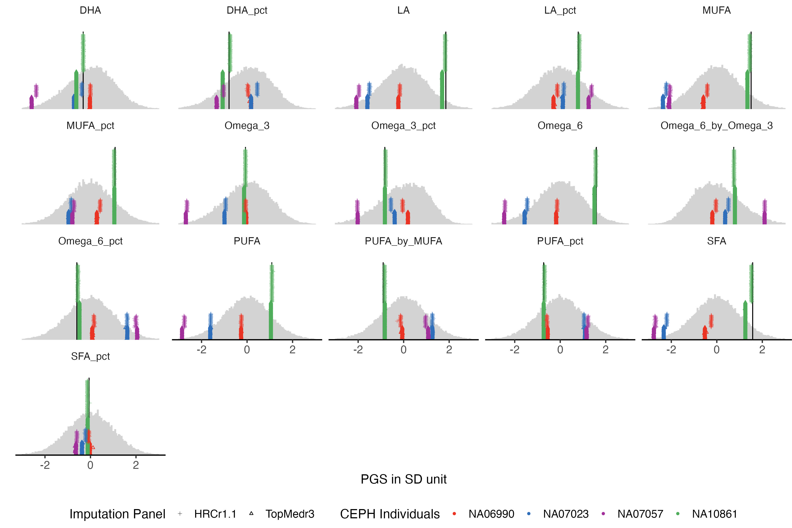
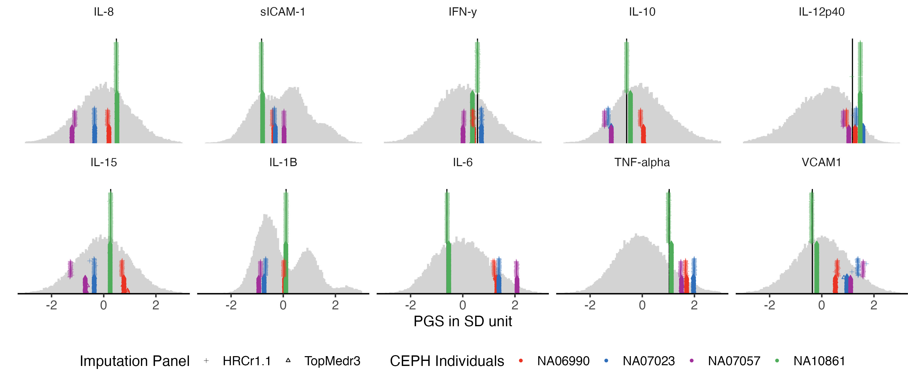
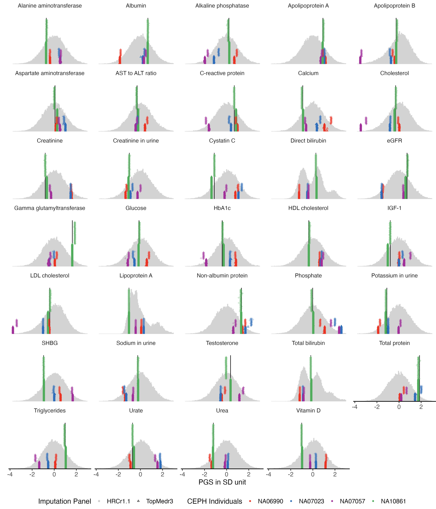

```{r setup, echo=FALSE, message=FALSE, warning=FALSE}
knitr::opts_chunk$set(message = FALSE, warning = FALSE)
# You need these libraries to run this template:

library(rmarkdown)    # install.packages("rmarkdown") 
library(epuRate)      # devtools::install_github("holtzy/epuRate", force=TRUE)
library(ggplot2)
library(DT)
library(plotly)
library(data.table)
library(gridExtra)
library(grid)
library(ggfortify)
library(reshape2)
library(cowplot)
library(ggpubr)
library(kableExtra)
library(openxlsx)
library(plotROC)
library(pROC)
library(dplyr)
library(tibble)
library(tidyr)
library(patchwork)
library(knitr)
library(kableExtra)
library(ggrepel)

```


<br>
<br>
<br>

Four CEPH samples (NA06990, NA07023, NA07057, NA10861) genotyped multiple times on the same array (Illumina GSAMD-24v1-0_20011747)  by QIMRB were imputed to both HRCr1.1 and TOPMed reference panels.
Comparing the PGS from the two different imputation, we find most traits highly consistent except a few. 

Investigation on the two sets of data suggest the main difference in PGS are caused by the different SNP coverage. Hereby we developed a new method to transit the SNP weights to existing SNPs from missing SNPs when using the high density of SBayesRC predictors. 

**Related pages:** [PGS:QS](10_PGS_QS.html) · [Missing SNPs and PGS-impute](10_PGS_impute_missing_SNPs.html)


```{r, eval = F,echo = F}
predictor.list = read.csv("Tables/SupTable2_Predictors.csv")
included_traits = predictor.list$Predictor

## benchmarking data
prs.bench.norm = read.csv("Data/LL/LifeLines1_Eur_140_traits_GCTB_PRS_self_standardized.csv", row.names = 1)

## extract used traits
prs.bench.norm = prs.bench.norm[,colnames(prs.bench.norm)%in%included_traits]
prs.bench.norm$IID = row.names(prs.bench.norm)

## melt it
melted.prs = reshape2::melt(prs.bench.norm,  id.vars = "IID")
melted.prs$value = as.numeric(melted.prs$value)

## add the Label of phenotype
melted.prs$Trait = predictor.list[match(melted.prs$variable, predictor.list$Predictor),"Label"]

control.prs = read.csv("Data/LL_standardized_PGS_of_CEPH_samples.csv", row.names = 1)

## keep selected traits
control.prs = cbind(control.prs[,1:11], control.prs[,included_traits])

## order it
control.prs = control.prs %>% arrange(Study_ID,Chip, Genotyping.lab)
full.control.prs = control.prs

# Prepare data for plot

## Set up WGS verticle lines

# set the position of the vertical line as WGS data
data.vert = control.prs[which(control.prs$Chip =="WGS"), which(colnames(control.prs)%in%c(included_traits ,"Study_ID" ))]

row.names(data.vert) = data.vert$Study_ID
data.vert = data.vert[,-1]
data.vert = data.frame(t(data.vert))
data.vert = data.vert[row.names(data.vert)%in%included_traits,]
data.vert$variable = row.names(data.vert)
data.vert$Trait = predictor.list[match(data.vert$variable, predictor.list$Predictor),"Label"]


## set color

color4 =c("#EA3323", "#2F6EBA",  "#A12F9A", "#4FAD5B")


## selected data imputed with both HRC and TopMed

## keep only one chip to compare
control.prs = data.frame(control.prs[which(control.prs$Chip == "GSAMD-24v1-0_20011747" ), ])

## exclude none important control samples 
sample.list = c("NA06990", "NA07023","NA07057",  "NA10861")
control.prs = control.prs[control.prs$Study_ID%in% sample.list,]

## drop sample levels
control.prs$Study_ID = factor(control.prs$Study_ID , levels = unique(control.prs$Study_ID ))
control.prs$Genotyping.lab = factor(control.prs$Genotyping.lab , levels = unique(control.prs$Genotyping.lab))

## set panel order
panel.order = c( "TopMedr3", "HRCr1.1")
control.prs$imputation_panel = factor(control.prs$imputation_panel, levels =panel.order )


## add y position for control samples

control.prs <- control.prs %>%
  arrange(imputation_panel) %>%
  group_by(Study_ID) %>%
  mutate(y.position = row_number()) %>%
  ungroup()  # Ungroup to return to normal data frame structure

control.prs$y.position = 5*(control.prs$y.position)
control.prs = data.frame(control.prs)


## melt the data

melted.control.prs = reshape2::melt(control.prs, 
                          id.vars =colnames(control.prs)[!colnames(control.prs)%in%included_traits], 
                          measure.vars = colnames(control.prs)[colnames(control.prs)%in%included_traits])
melted.control.prs$value = as.numeric(melted.control.prs$value)

## use phenotype name instead of predictor name 
melted.control.prs$Trait = predictor.list[match(melted.control.prs$variable, predictor.list$Predictor),"Label"]

```


# summary difference

Here is a plot of average PGS comparing between the two imputation panel. 

```{r, eval = F}

mean.prs.summary = melted.control.prs%>% 
  group_by(Study_ID, variable, Impute_Panel) %>%
  summarise(
    mean.prs = mean(value)
  )%>%
  pivot_wider(
    names_from = Impute_Panel,
    values_from = mean.prs
  )

mean.prs.summary$difference = abs(mean.prs.summary$TopMedr3 - mean.prs.summary$HRCr1.1)

```


```{r, eval =  F}

cross.sample.mean = mean.prs.summary %>% 
  group_by(variable) %>% 
  summarise(mean_difference = mean(difference)) %>% 
  arrange(mean_difference)

hist(cross.sample.mean$mean_difference, breaks = 50)
```



```{r, eval = F}


ggplot(data = mean.prs.summary, aes(x = HRCr1.1, y = TopMedr3, color =  Study_ID)) + geom_point()+ 
  geom_abline(intercept = 0, slope = 1) +
  geom_text_repel(data = mean.prs.summary %>% filter(difference > 0.5 ) , 
                    aes(label = variable), vjust = -1, color = "black", size = 1.5)


```




# PGS Variation from imputation panels   

## set up function to plot

```{r, eval = F}
## define function
panel_plot = function(example.traits, facet.col, legend.pos, 
                      melted.control.prs, data.vert, melted.prs ){

  ## we already have the data melted.prs, data.vert and melted.control.prs which includes all the traits. 
  ## this function make plots with subsets of traits. 
  
## select traits in data and  simplify to only HRC imputed for control samples
example.melted.prs = melted.prs[which(melted.prs$variable %in% example.traits ),]
example.data.vert = data.vert[which(data.vert$variable %in% example.traits),]
example.melted.control.prs = melted.control.prs[which(melted.control.prs$variable %in% example.traits ),]

# set order
order.matching.table = unique(example.melted.prs [,c("variable", "Trait")])
trait.order.for.plot = order.matching.table[match(example.traits, order.matching.table$variable), "Trait"]


## make them in factor
example.melted.prs$Trait = factor(example.melted.prs$Trait, levels = trait.order.for.plot)
example.data.vert$Trait = factor(example.data.vert$Trait, levels =trait.order.for.plot)
example.melted.control.prs$Trait = factor(example.melted.control.prs$Trait, levels = trait.order.for.plot)

example.melted.control.prs$imputation_panel = factor(example.melted.control.prs$imputation_panel, levels = rev(panel.order) )

xlimleft = round(min(c(-3, min(example.melted.control.prs$value)  ) ) - 0.05 , 1)
xlimright= round(max(c(3, max(example.melted.control.prs$value)  ) ) + 0.05 ,1)

## make plot
example.g.hist = ggplot() + 
  geom_histogram(data =example.melted.prs , aes(x = value ), bins = 150, fill = "light grey", color = "light grey") + 
  facet_wrap(~Trait,  ncol= facet.col ) + 
#  geom_vline(data = example.data.vert, mapping = aes(xintercept = NA10861), color = "black") +
  geom_segment(data = example.data.vert, aes(x =NA10861, xend = NA10861, y= 0, yend = 1100 ) ) +
    geom_point(data = example.melted.control.prs, aes(x = value, y =y.position, color = Study_ID, shape = imputation_panel, alpha = imputation_panel), size = 1) + 
  xlab("PGS in SD unit") +
  ylab("") + xlim(xlimleft, xlimright) +
    theme_classic(base_size = 14) +
theme(
   panel.grid.major = element_blank(), # Remove major grid lines
    panel.grid.minor = element_blank(), # Remove minor grid lines
    plot.title = element_text(hjust = 0.5),
    axis.title = element_text(),
    axis.text = element_text(size = 12),
    legend.position = legend.pos ,
    legend.text = element_text(size = 12),      # Legend item labels
    legend.title = element_text(size = 14)  ,
    strip.background = element_blank(),
#    strip.text = element_text(margin = margin(b = 20)),  # Add space below facet title
plot.margin = margin(0.1, 0.1, 0.1, 0.1)
   )+
  scale_alpha_manual(name = "Imputation Panel", values = c(0.4,1) ) +
  scale_shape_manual(name = "Imputation Panel", values = c(3,2) ) +
  scale_color_manual(
    name = "CEPH Individuals",
    values = c( color4)) + 
  scale_y_continuous(labels = NULL, breaks = NULL, expand = expansion(mult = c(0, 0.15)))  # Remove both labels and ticks

return(example.g.hist)

}
```

## figA. plot four good examples


```{r, fig.width=12, fig.height=3, eval = F}

example.traits = c("Height_03", "BMI_02", "Migraine_01", "IBD_02", 
                   "Glaucoma_01", "HairColor_01", "LungCancer_01", "UKB_FA_2022_met.d.DHA_pct")


example.impu.hist1 = panel_plot(example.traits = example.traits[1:4],  facet.col = 4 , legend.pos = "none",  melted.control.prs = melted.control.prs, data.vert = data.vert, melted.prs =melted.prs )


info.text.a = data.frame(
 variable = example.traits[1:4],
 Trait = predictor.list[match(example.traits[1:4], predictor.list$Predictor),"Label"],
 variance = format(round(predictor.list[match(example.traits[1:4], predictor.list$Predictor),"total.variance"],3 ), nsmall=3) ,
 HRCr1.1 = paste0( round(100 * predictor.list[match(example.traits[1:4], predictor.list$Predictor),"QIMR_HRC"], 1 ) ,  "%"),
 TopMedr3 = paste0( round(100 * predictor.list[match(example.traits[1:4], predictor.list$Predictor),"QIMR_TopMed"], 1 ) ,  "%"),
 x = -0.5,
 y = Inf
)

info.text.a$variable = factor(info.text.a$variable , levels = info.text.a$variable )

info.text.a$Trait = factor(info.text.a$Trait , levels = info.text.a$Trait )

info.text.a$labels = paste0("V=", info.text.a$variance ,"; +:", info.text.a$HRCr1.1, "; \u25B3",":" , info.text.a$TopMedr3)

labeled.example.impu.hist1 = example.impu.hist1 + 
  geom_text(
    data = info.text.a,
    aes(x = median(x), y = y, label = (labels) ),
    inherit.aes = FALSE,
    vjust =1,        # Push down from top
    hjust = 0.5,
    size = 4,
    family = "Arial Unicode MS"
  ) 

labeled.example.impu.hist1

```



## figB. four examples with large difference

```{r, fig.width=12, fig.height=3, eval = F}


example.impu.hist2 = panel_plot(example.traits = example.traits[5:8],  facet.col = 4 , legend.pos = "bottom", 
                            melted.control.prs = melted.control.prs, data.vert = data.vert, melted.prs =melted.prs )

info.text.b = data.frame(
 variable = example.traits[5:8],
 Trait = predictor.list[match(example.traits[5:8], predictor.list$Predictor),"Label"],
 variance = format(round(predictor.list[match(example.traits[5:8], predictor.list$Predictor),"total.variance"],3 ), nsmall=3) ,
 HRCr1.1 = paste0( round(100 * predictor.list[match(example.traits[5:8], predictor.list$Predictor),"QIMR_HRC"], 1 ) ,  "%"),
 TopMedr3 = paste0( round(100 * predictor.list[match(example.traits[5:8], predictor.list$Predictor),"QIMR_TopMed"], 1 ) ,  "%"),
 x = -0.5,
 y = Inf
)

info.text.b$variable = factor(info.text.b$variable , levels = info.text.b$variable )
info.text.b$Trait = factor(info.text.b$Trait , levels = info.text.b$Trait )

info.text.b$labels = paste0("V=", info.text.b$variance ,"; +:", info.text.b$HRCr1.1, "; \u25B3",":" , info.text.b$TopMedr3)

labeled.example.impu.hist2 = example.impu.hist2 + 
  geom_text(
    data = info.text.b,
    aes(x = median(x), y = y, label = (labels) ),
    inherit.aes = FALSE,
    vjust =1,        # Push down from top
    hjust = 0.5,
    size = 4,
    family = "Arial Unicode MS"
  ) 

labeled.example.impu.hist2
```





# PGS variation of all traits (SupFig3 )

We used the same plot function to display all the 115 traits in 5 groups. 

## binary traits


```{r, fig.width=12, fig.height=16, eval = F}

example.g.hist = panel_plot(example.traits = traits_binary, facet.col = 5, legend.pos = "bottom" , 
                              melted.control.prs = melted.control.prs, data.vert = data.vert, melted.prs =melted.prs)
example.g.hist

fig.heit = ceiling(length(traits_binary) / 5 ) *2
#ggsave(example.g.hist, filename = "Figures/Fig_PGS_benchmarking_example_HRC_vs_TOPmed_binary.jpeg", width = 12, height = fig.heit)


```



## quantitative traits


```{r, fig.width=12, fig.height=10, eval = F}

example.g.hist = panel_plot(example.traits = traits_quanti, facet.col = 5,  legend.pos = "bottom", 
                            melted.control.prs = melted.control.prs, data.vert = data.vert, melted.prs =melted.prs  )

example.g.hist

fig.heit = ceiling(length( traits_quanti) / 5 ) *2
#fig.heit

#ggsave(example.g.hist ,   filename = "Figures/Fig_PGS_benchmarking_example_HRC_vs_TOPmed_quanti.jpeg", width = 12, height = fig.heit)


```



## fatty acid 


```{r, fig.width=12, fig.height=8, eval = F}

traits_fa = traits_pfa[grep("UKB_FA", traits_pfa)]
example.g.hist = panel_plot(example.traits = traits_fa, facet.col = 5,  legend.pos = "bottom" , 
                            melted.control.prs = melted.control.prs, data.vert = data.vert, melted.prs =melted.prs )

example.g.hist

fig.heit = ceiling(length( traits_fa) / 5 ) *2

#ggsave(example.g.hist ,  filename = "Figures/Fig_PGS_benchmarking_example_HRC_vs_TOPmed_FattyAcid.jpeg", width = 12, height = 8)

```



## proteomics


```{r, fig.width=12, fig.height=5, eval = F}

traits_ppp = traits_pfa[grep("UKB_PPP", traits_pfa)]


example.g.hist = panel_plot(example.traits = traits_ppp, facet.col = 5,  legend.pos = "bottom" , 
                            melted.control.prs = melted.control.prs, data.vert = data.vert, melted.prs =melted.prs )

example.g.hist

fig.heit = ceiling(length( traits_ppp) / 5 ) *2

#ggsave(example.g.hist ,  filename = "Figures/Fig_PGS_benchmarking_example_HRC_vs_TOPmed_Proteomics.jpeg", width = 12, height = 5)

```




## 35 biomarkers


```{r, fig.width=12, fig.height=14, eval = F}

example.g.hist = panel_plot(example.traits = traits_35bm, facet.col = 5,  legend.pos = "bottom" , 
                            melted.control.prs = melted.control.prs, data.vert = data.vert, melted.prs =melted.prs )

example.g.hist

fig.heit = ceiling(length( traits_35bm) / 5 ) *2

#ggsave(example.g.hist ,  filename = "Figures/Fig_PGS_benchmarking_example_HRC_vs_TOPmed_35Biomarkers.jpeg", width = 12, height = fig.heit)

```





---

**Also see:** [PGS:QS (quality score)](10_PGS_QS.html) · [Missing SNPs and PGS-impute](10_PGS_impute_missing_SNPs.html)
