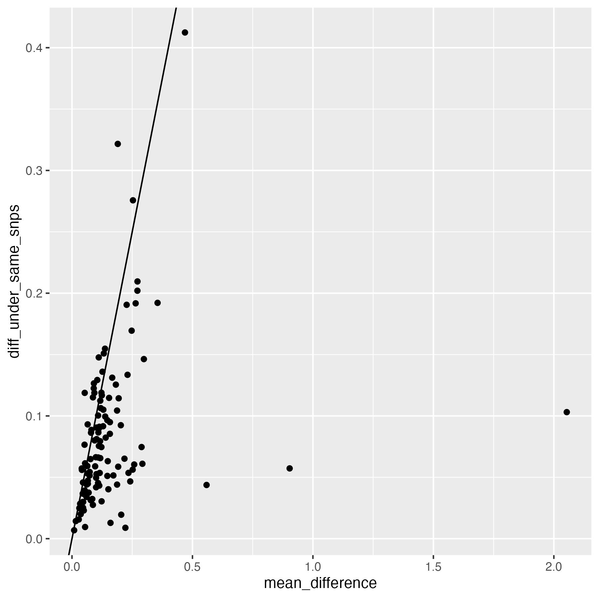
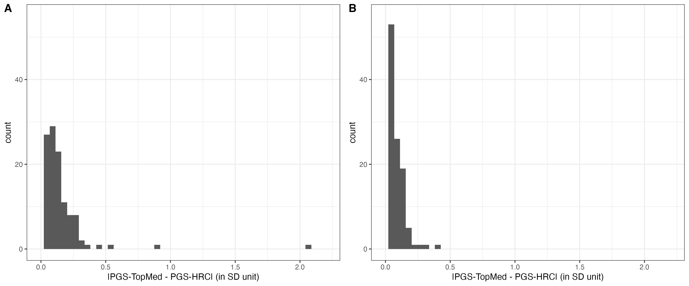
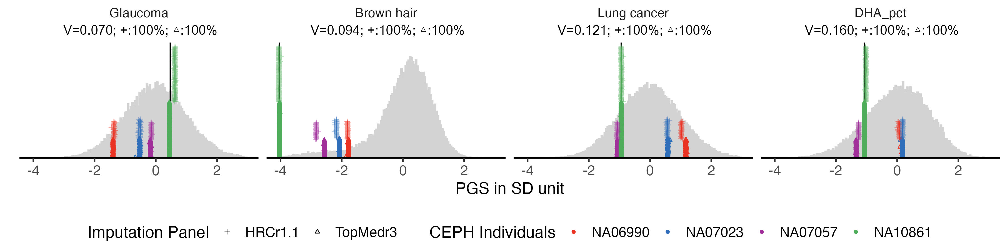
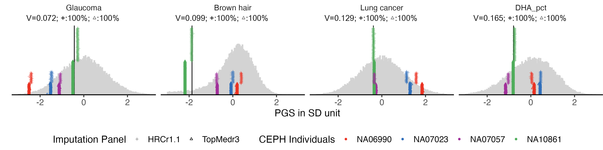
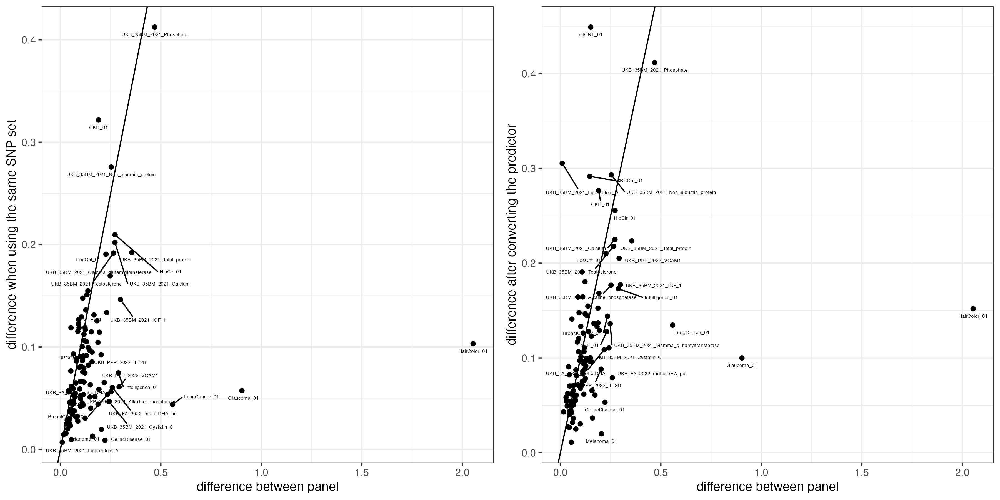

```{r setup, echo=FALSE, message=FALSE, warning=FALSE}
knitr::opts_chunk$set(message = FALSE, warning = FALSE)
# You need these libraries to run this template:

library(rmarkdown)    # install.packages("rmarkdown") 
library(epuRate)      # devtools::install_github("holtzy/epuRate", force=TRUE)
library(ggplot2)
library(DT)
library(plotly)
library(data.table)
library(gridExtra)
library(grid)
library(ggfortify)
library(reshape2)
library(cowplot)
library(ggpubr)
library(kableExtra)
library(openxlsx)
library(plotROC)
library(pROC)
library(dplyr)
library(tibble)
library(tidyr)
library(patchwork)
library(knitr)
library(kableExtra)
library(ggrepel)

```

<br>
<br>
<br>

This page complements [Imputation panel comparison (HRC vs TOPMed)](10_Imputation_Panel_effect.html) and [PGS:QS](10_PGS_QS.html). It follows the manuscript **Results** section on separating missing SNPs from genotype error, the **PGS-impute** approach (GCTB `--convert`), supplementary figures, and Glaucoma / Hair colour genotype checks.

---

# Test whether difference is from missing or error


## profile PGS without the missing SNPs

```{bash, eval = F}
## define predictor
traitfile="/QRISdata/Q6913/GCTB_predictor_list_for_batch_profiling.txt"
trait=$(sed "${i}q;d" $traitfile | awk '{print $1}' )
predictor=$(sed  "${i}q;d"  $traitfile  | awk '{print $3}' )
echo $trait
echo $predictor


outdir=PRS_all_GCTB
mkdir -p $outdir

data1="WGS_NA10861"
genofile1=ceph_combined_SBRC_SNPs.vcf

plink \
  --vcf  $genofile1 \
  --score  $predictor  2 5 8  header sum    \
  --exclude missing_in_any_SNPs_for_NA10861.txt  \
  --out    ${outdir}/${data1}_${trait}_SBayesRC

data2=GSA_HRCr1.1
genofile2=Merged_plink/GSA_HRCr1.1_autosomes

plink \
  --bfile  $genofile2 \
  --score  $predictor  2 5 8  header sum    \
  --exclude missing_in_any_SNPs_for_NA10861.txt  \
  --out    ${outdir}/${data2}_${trait}_SBayesRC

data3=GSA_TopMed
genofile3=Merged_plink/GSA_TOPMedr3_autosomes_7.3M_subset

plink \
  --bfile  $genofile3 \
  --score  $predictor  2 5 8  header sum    \
  --exclude missing_in_any_SNPs_for_NA10861.txt  \
  --out    ${outdir}/${data3}_${trait}_SBayesRC
```

compare the PGS of NA10861 between the three resources

```{bash, eval = F}
outdir=PRS_all_GCTB
traitfile="/QRISdata/Q6913/GCTB_predictor_list_for_batch_profiling.txt"

data3=GSA_TopMed
genofile3=Merged_plink/GSA_TOPMedr3_autosomes_7.3M_subset

data2=GSA_HRCr1.1
genofile2=Merged_plink/GSA_HRCr1.1_autosomes

Rscript merge_PGS.R ${genofile2}.fam  $traitfile $outdir $data2

```


## combine the data


```{r, eval = F}

## input PGS from TopMed imputed
ceph_consis_PRS_TopMed = read.csv("Data/missingness_check/PRS_all_GCTB_GSA_TopMed_all_139_traits_GCTB_PRS.csv", row.names =1)
ceph_consis_PRS_TopMed= ceph_consis_PRS_TopMed[,match(included_traits, colnames(ceph_consis_PRS_TopMed) )]
ceph_consis_PRS_TopMed$imputation_panel = "TopMedr3"

## input PGS from HRC imputed
ceph_consis_PRS_HRC = read.csv("Data/missingness_check/PRS_all_GCTB_GSA_HRCr1.1_all_139_traits_GCTB_PRS.csv", row.names =1)
ceph_consis_PRS_HRC= ceph_consis_PRS_HRC[,match(included_traits, colnames(ceph_consis_PRS_HRC) )]
ceph_consis_PRS_HRC$imputation_panel = "HRCr1.1"

## merge
ceph_consis_PRS = rbind(ceph_consis_PRS_TopMed, ceph_consis_PRS_HRC)

## get the four samples
pattern <- paste(c("NA06990", "NA07023", "NA07057", "NA10861"), collapse = "|")
ceph_consis_PRS <- ceph_consis_PRS[grepl(pattern, row.names(ceph_consis_PRS)), ]


## input PGS from WGS using only overlap SNPs
ceph_consis_PRS_WGS = read.table("Data/missingness_check/NA10861_WGS_PRS_vGCTB.txt")
ceph_consis_PRS_WGS$V1 = gsub("-", ".",ceph_consis_PRS_WGS$V1  )
ceph_consis_PRS_WGS = (ceph_consis_PRS_WGS[ match(included_traits, ceph_consis_PRS_WGS$V1),])
colnames(ceph_consis_PRS_WGS) = c("variable", "CN1", "CN2", "NA10861")

```

## standardize and melt

```{r, eval = F}


mean.sd.table = read.csv("Data/LifeLines_MEAN_and_SD_of_traits_for_standardization.csv", row.names = 1)
mean.sd.table = mean.sd.table[match(included_traits, mean.sd.table$trait ),]

ceph_consis_PRS.norm = sweep(sweep (  sapply (ceph_consis_PRS[,included_traits],  as.numeric  ), 2, mean.sd.table$mean),  2, mean.sd.table$sd, FUN = '/')
ceph_consis_PRS.norm = data.frame(ceph_consis_PRS.norm)

ceph_consis_PRS.norm$imputation_panel = ceph_consis_PRS$imputation_panel
row.names(ceph_consis_PRS.norm) = row.names(ceph_consis_PRS)


ceph_consis_PRS.norm$IID = sapply(strsplit(row.names(ceph_consis_PRS), "_"), `[`, 4)
ceph_consis_PRS.norm$imputation_panel = factor(ceph_consis_PRS.norm$imputation_panel , levels = panel.order)

ceph_consis_PRS.norm = ceph_consis_PRS.norm %>%  
  arrange(imputation_panel) %>%
  group_by(IID) %>%
  mutate(y.position = row_number()) %>%
  ungroup()  # Ungroup to return to normal data frame structure

  
ceph_consis_PRS.norm$y.position =ceph_consis_PRS.norm$y.position * 5

## melt it
melted_ceph_consis_PRS = reshape2::melt(ceph_consis_PRS.norm, 
                  id.vars =c("IID", "imputation_panel", "y.position") , 
                  measure.vars =included_traits )
colnames(melted_ceph_consis_PRS)[1] = "Study_ID"

ceph_consis_PRS_WGS$NA10861 =  ( ceph_consis_PRS_WGS$NA10861 -  mean.sd.table$mean) / mean.sd.table$sd

## add label
ceph_consis_PRS_WGS$Trait = predictor.list[match(ceph_consis_PRS_WGS$variable, predictor.list$Predictor),"Label"]
melted_ceph_consis_PRS$Trait =  predictor.list[match(melted_ceph_consis_PRS$variable, predictor.list$Predictor),"Label"]


```

## summary difference


```{r, eval = F}

mean.prs.with.missing.summary = melted_ceph_consis_PRS%>% 
  group_by(Study_ID, variable, imputation_panel) %>%
  summarise(
    mean.prs = mean(value)
  )%>%
  pivot_wider(
    names_from = imputation_panel,
    values_from = mean.prs
  )

mean.prs.with.missing.summary$difference = abs(mean.prs.with.missing.summary$TopMedr3 - mean.prs.with.missing.summary$HRCr1.1)

cross.sample.mean.prs.with.missing.summary= mean.prs.with.missing.summary %>% group_by(variable) %>% summarise(mean_difference = mean(difference)) %>% arrange(mean_difference)

cross.sample.mean = data.frame(cross.sample.mean)
cross.sample.mean.prs.with.missing.summary = data.frame(cross.sample.mean.prs.with.missing.summary)
cross.sample.mean$diff_under_same_snps = cross.sample.mean.prs.with.missing.summary[ match(cross.sample.mean$variable, cross.sample.mean.prs.with.missing.summary$variable), "mean_difference"]
```


```{r, eval = F}

ggplot(data = cross.sample.mean, aes(x = mean_difference, y = diff_under_same_snps)) + geom_point() + geom_abline(intercept = 0, slope =1)


```



## sup fig 6

```{r, fig.height=5, fig.width=12, eval = F}


hist.a = ggplot(data = cross.sample.mean, aes(x = mean_difference)) + geom_histogram(bins =50) + xlab( "|PGS-TopMed - PGS-HRC| (in SD unit)"   ) + theme_bw()  + xlim(0,2.2) + ylim(0,55)
hist.b = ggplot(data = cross.sample.mean, aes(x = diff_under_same_snps)) + geom_histogram(bins =50) + xlab( "|PGS-TopMed - PGS-HRC| (in SD unit)"   ) + theme_bw()   + xlim(0,2.2) + ylim(0,55)

hist.supfig6 = ggarrange(hist.a, hist.b, labels = c("A", "B"))
hist.supfig6
ggsave( "Figures/SupFig6_hist_of_difference.jpeg", hist.supfig6, width = 12, height = 5)

```



## plot

```{r, fig.height=3, fig.width=12, eval = F}

example.traits = example.traits[5:8]


example.consist.hist =  panel_plot(example.traits =example.traits, facet.col = 4,  legend.pos = "bottom" , melted_ceph_consis_PRS , ceph_consis_PRS_WGS, melted.prs )
 

info.text.c = data.frame(
 variable = example.traits,
 Trait = predictor.list[match(example.traits, predictor.list$Predictor),"Label"],
 variance = format(round((predictor.list[match(example.traits, predictor.list$Predictor),"total.variance"]) * (predictor.list[match(example.traits, predictor.list$Predictor),"QIMR_TopMed"]) ,3 ), nsmall=3) ,
# HRCr1.1 = paste0( round(100 * predictor.list[match(example.traits[5:8], predictor.list$Predictor),"QIMR_TopMed"], 1 ) ,  "%"),
# TopMedr3 = paste0( round(100 * predictor.list[match(example.traits[5:8], predictor.list$Predictor),"QIMR_TopMed"], 1 ) ,  "%"),
HRCr1.1 = "100%",
TopMedr3 = "100%",
 x = -0.5,
 y = Inf
)

info.text.c$variable = factor(info.text.c$variable , levels = info.text.c$variable )
info.text.c$Trait = factor(info.text.c$Trait , levels = info.text.c$Trait )

info.text.c$labels = paste0("V=", info.text.c$variance ,"; +:", info.text.c$HRCr1.1, "; \u25B3",":" , info.text.c$TopMedr3)

labeled.example.consist.hist  = example.consist.hist + 
  geom_text(
    data = info.text.c,
    aes(x = median(x), y = y, label = (labels) ),
    inherit.aes = FALSE,
    vjust =1,        # Push down from top
    hjust = 0.5,
    size = 4,
    family = "Arial Unicode MS"
  ) 

labeled.example.consist.hist


```




# Examine convert function in fixing the missingness

We are using correlation of PGS to show how the PGS got affected by SNP missingness, and how the convert function recover the PGS. 

## convert SNP weight for missing SNPs 

The function is added to GCTB. 

SNP weight of the missing SNPs are converted to the existing SNPs. 

```{bash, eval = F}

## define predictor
traitfile="GCTB_predictor_list_with_7.3M.txt"
trait=$(sed "${i}q;d" $traitfile | awk '{print $1}' )
predictor=$(sed  "${i}q;d"  $traitfile  | awk '{print $3}' )
echo $trait
echo $predictor

targetlist=SNP_list_for_nonmissing_test.txt
ldm=/QRISdata/Q6913/Pipeline/ukbEUR_Imputed
gctb="/scratch/project_mnt/S0007/jzeng/repo/GCTB_dev/scr/gctb"

$gctb --convert  \
--snp-res $predictor  \
--ldm-eigen  $ldm \
--extract  $targetlist  \
--thread 8 \
--out Converted_predictors/${trait}_converted_nonmissing_SBayesRC_predictor

```


## combine the data


```{r, eval = F}


## input PGS from TopMed imputed using converted predictors
ceph_convert_PRS_TopMed = read.csv("Data/missingness_check/QIMR_TopMed_PGS_from_converted_predictors_QIMR_GSA_TopMedr3_imputed_all_123_traits_GCTB_PRS.csv", row.names =1)

included_traits = included_traits[included_traits %in% colnames(ceph_convert_PRS_TopMed)]

ceph_convert_PRS_TopMed= ceph_convert_PRS_TopMed[,match(included_traits, colnames(ceph_convert_PRS_TopMed) )]
ceph_convert_PRS_TopMed$imputation_panel = "TopMedr3"

## input PGS from HRC imputed using original predictor
ceph_PRS_HRC = read.csv("Data/QIMR/PRS_all_GCTB_GSA_HRCr1.1_all_140_traits_GCTB_PRS.csv", row.names =1)
ceph_PRS_HRC= ceph_PRS_HRC[,match(included_traits, colnames(ceph_PRS_HRC) )]
ceph_PRS_HRC$imputation_panel = "HRCr1.1"

## merge
ceph_convert_PRS = rbind(ceph_convert_PRS_TopMed, ceph_PRS_HRC)

## get the four samples
pattern <- paste(c("NA06990", "NA07023", "NA07057", "NA10861"), collapse = "|")
ceph_convert_PRS <- ceph_convert_PRS[grepl(pattern, row.names(ceph_convert_PRS)), ]


## input PGS from WGS using original predictor
ceph_PRS_WGS = read.table("Data/WGS/NA10861_WGS_PRS_vGCTB.txt", header = T)
ceph_PRS_WGS$V1 = gsub("-", ".", ceph_PRS_WGS$V1)
ceph_PRS_WGS = (ceph_PRS_WGS[ match(included_traits, ceph_PRS_WGS$V1),])
colnames(ceph_PRS_WGS) = c("variable", "CN1", "CN2", "NA10861")

```

## standardize and melt

```{r, eval = F}

mean.sd.table = read.csv("Data/LifeLines_MEAN_and_SD_of_traits_for_standardization.csv", row.names = 1)
mean.sd.table = mean.sd.table[match(included_traits, mean.sd.table$trait ),]

ceph_convert_PRS.norm = sweep(sweep (  sapply (ceph_convert_PRS[,included_traits],  as.numeric  ), 2, mean.sd.table$mean),  2, mean.sd.table$sd, FUN = '/')
ceph_convert_PRS.norm = data.frame(ceph_convert_PRS.norm)

ceph_convert_PRS.norm$imputation_panel = ceph_convert_PRS$imputation_panel
row.names(ceph_convert_PRS.norm) = row.names(ceph_convert_PRS)


ceph_convert_PRS.norm$Study_ID = sapply(strsplit(row.names(ceph_convert_PRS), "_"), `[`, 4)
ceph_convert_PRS.norm$imputation_panel = factor(ceph_convert_PRS.norm$imputation_panel , levels = panel.order)

ceph_convert_PRS.norm = ceph_convert_PRS.norm %>%  
  arrange(imputation_panel) %>%
  group_by(Study_ID) %>%
  mutate(y.position = row_number()) %>%
  ungroup()  # Ungroup to return to normal data frame structure

  
ceph_convert_PRS.norm$y.position =ceph_convert_PRS.norm$y.position * 5

## melt it
melted_ceph_convert_PRS = reshape2::melt(ceph_convert_PRS.norm, 
                  id.vars =c("Study_ID", "imputation_panel", "y.position") , 
                  measure.vars =included_traits )

ceph_PRS_WGS$NA10861 =  ( ceph_PRS_WGS$NA10861 -  mean.sd.table$mean) / mean.sd.table$sd

## add label

ceph_PRS_WGS$Trait = predictor.list[match(ceph_PRS_WGS$variable, predictor.list$Predictor),"Label"]
melted_ceph_convert_PRS$Trait =  predictor.list[match(melted_ceph_convert_PRS$variable, predictor.list$Predictor),"Label"]


```

## summarize


```{r, eval = F}

mean.prs.with.convert.summary = melted_ceph_convert_PRS%>% 
  group_by(Study_ID, variable, imputation_panel) %>%
  summarise(
    mean.prs = mean(value)
  )%>%
  pivot_wider(
    names_from = imputation_panel,
    values_from = mean.prs
  )

mean.prs.with.convert.summary$difference = abs(mean.prs.with.convert.summary$TopMedr3 - mean.prs.with.convert.summary$HRCr1.1)

cross.sample.mean.prs.with.convert.summary= mean.prs.with.convert.summary %>% group_by(variable) %>% summarise(mean_difference = mean(difference)) %>% arrange(mean_difference)

cross.sample.mean = data.frame(cross.sample.mean)
cross.sample.mean.prs.with.convert.summary = data.frame(cross.sample.mean.prs.with.convert.summary)
cross.sample.mean$diff_from_convert = cross.sample.mean.prs.with.convert.summary[ match(cross.sample.mean$variable, cross.sample.mean.prs.with.convert.summary$variable), "mean_difference"]

```


## plot


```{r, fig.height=3, fig.width=12, eval = F}


example.convert.hist =  panel_plot(example.traits =example.traits, facet.col = 4,  legend.pos = "bottom" , melted_ceph_convert_PRS , ceph_PRS_WGS, melted.prs )
 

info.text.d = data.frame(
 variable = example.traits,
 Trait = predictor.list[match(example.traits, predictor.list$Predictor),"Label"],
 variance = format(round((predictor.list[match(example.traits, predictor.list$Predictor),"total.variance"]) ,3 ) , nsmall=3) ,
 #HRCr1.1 = paste0( round(100 * predictor.list[match(example.traits[5:8], predictor.list$Predictor),"QIMR_TopMed"], 1 ) ,  "%"),
 #TopMedr3 = paste0( round(100 * predictor.list[match(example.traits[5:8], predictor.list$Predictor),"QIMR_HRC"], 1 ) ,  "%"),
 HRCr1.1 = "100%",
TopMedr3 = "100%",
x = -0.5,
 y = Inf
)

info.text.d$variable = factor(info.text.d$variable , levels = info.text.d$variable )
info.text.d$Trait = factor(info.text.d$Trait , levels = info.text.d$Trait )

info.text.d$labels = paste0("V=", info.text.d$variance ,"; +:", info.text.d$HRCr1.1, "; \u25B3",":" , info.text.d$TopMedr3)

labeled.example.convert.hist  = example.convert.hist + 
  geom_text(
    data = info.text.d,
    aes(x = median(x), y = y, label = (labels) ),
    inherit.aes = FALSE,
    vjust =1,        # Push down from top
    hjust = 0.5,
    size = 4,
    family = "Arial Unicode MS"
  ) 

labeled.example.convert.hist

# ggsave(labeled.example.convert.hist, filename = "Figures/Fig4_PGS_consistency_when_using_converted_predictors_in_ToPMed.jpeg", width = 12, height = 3)
```



# summary of changes


```{r, fig.width=8, fig.height=6, eval = F}


cross.sample.mean = cross.sample.mean %>%
    mutate(across(where(is.numeric), ~ round(.x, 3)))

write.csv(cross.sample.mean, "Tables/SupTable3_difference_between_imputation_panel_and_coverted.csv")

fig.a =  ggplot(data = cross.sample.mean, aes(x = mean_difference, y = diff_from_convert)) + 
  geom_point() + 
  geom_abline(intercept = 0, slope =1)+ 
  geom_text_repel(data = cross.sample.mean %>% filter(mean_difference > 0.2 | diff_from_convert > 0.2) , 
                    aes(label = variable), vjust = -1, color = "black", size = 1.5)  +
  xlab("difference between panel") +
  ylab("difference after converting the predictor") +
  theme_bw()

fig.b =  ggplot(data = cross.sample.mean, aes(x = mean_difference, y = diff_under_same_snps)) + 
  geom_point() + 
  geom_abline(intercept = 0, slope =1)+ 
  geom_text_repel(data = cross.sample.mean %>% filter(mean_difference > 0.2 | diff_from_convert > 0.2) , 
                    aes(label = variable), vjust = -1, color = "black", size = 1.5)  +
  xlab("difference between panel") +
  ylab("difference when using the same SNP set")+
  theme_bw()

fig.change = ggarrange(fig.b , fig.a,  nrow = 1)


fig.change


ggsave(filename = "Figures/SupFig3_imputation_panel_difference_before_and_after_convert.jpeg", plot = fig.change, width = 12, height = 6)
```



```{r, eval = F, echo = F}

datatable(
  cross.sample.mean,
  options = list(
    pageLength = 10,     # show 10 rows per page
    scrollX = TRUE       # enable horizontal scrolling
  ),
    filter = "top",  # Adds filter boxes for each column
class = 'display'
)

```


```{r, fig.width= 11, fig.height= 10, eval = F, echo = F}
# combine figures
library(patchwork)


a = labeled.example.impu.hist1+ theme(legend.position = "none" ) + xlab("")
b = labeled.example.impu.hist2 + theme(legend.position = "none" ) + xlab("")+ xlim(-4.2,3)
c = labeled.example.consist.hist + theme(legend.position = "none" )+ xlab("")+ xlim(-4.2,3)
d = labeled.example.convert.hist + theme(legend.position = "bottom" ) + xlim(-4.2,3)
 
combined.fig = a / b / c / d +  plot_layout(heights = c(2.8, 2.8, 2.8, 3) ) + 
  plot_annotation(tag_levels = 'A')&
  theme(plot.margin = margin(0, 0, 0, 0)) &               # optional: reduce internal margins
  theme(plot.spacing = unit(0, "lines"))     

combined.fig

#ggsave(plot = combined.fig, filename = "Figures/Fig3_PGS_imputation_panel_missingness_and_convert_function.png", width = 11, height = 10)
ggsave(plot = combined.fig, filename = "Figures/Fig3_PGS_imputation_panel_missingness_and_convert_function_with_UGLI1.jpeg", width = 11, height = 10)

```


# check genotype of Glaucoma


The top 1000 SNPs were picked from Glaucoma SBsyesRC weights. Genotype of these 1000 SNPs were extracted from the three data sets that included sample NA10861: WGS, HRC imputed and TopMed imputed QIMR Malanoma NCI cohort genotyped with GSAv2 chip.

The genotype value is in additive model as the number of risk alleles. We removed all the events that have exactly the same genotype in each data set, which resulted with 1 event from WGS, 1 event from TopMed imputation, and 4 event from HRC imputation. Then we matched these 6 events, and removed all the SNPs that have exactly the same calling among all of them. There are 13 SNPs remained.

Their genotype are merged with the SNP information, and sorted based on the SBayesRC SNP weight. All the genotype callings that are different from the calling in WGS are highlighted with red.

We can see that both the count of risk alleles and the partial PGS calculated from these SNPs are higher in HRC imputed events, which is consistent with the observation in whole PGS.
 
 
 
```{r, eval = F}

glaucoma.effect = data.frame(fread("../Large_Data/Glaucoma_01_SBayesRC.snpRes"))
top1000 = read.table("Data/missingness_check/Glaucoma_01_SBayesRC_top1000_SNPs.txt")
glaucoma.effect = glaucoma.effect[glaucoma.effect$Name %in% top1000$V1,]


glaucoma.effect$Risk_Allele <- ifelse(glaucoma.effect$A1Effect > 0,
                                      glaucoma.effect$A1,
                                      glaucoma.effect$A2)


glaucoma.effect$Bene_Allele <- ifelse(glaucoma.effect$A1Effect < 0,
                                      glaucoma.effect$A1,
                                      glaucoma.effect$A2)


glaucoma.effect$Risk_Allele_effect = abs(glaucoma.effect$A1Effect)

#write.table(glaucoma.effect[,c("Name", "Risk_Allele")], row.names = F, col.names = F, quote = F, sep ="\t", file = "Data/missingness_check/top1000SNP_Risk_Allele_of_Glaucoma.txt")

glaucoma.effect$SNP_Risk_Allele = paste0(glaucoma.effect$Name, "_", glaucoma.effect$Risk_Allele)
glaucoma.effect$SNP_Bene_Allele = paste0(glaucoma.effect$Name, "_", glaucoma.effect$Bene_Allele)

```


```{bash, eval = F}

## set reference allele
Merged_plink=/QRISdata/Q5740/QIMR_Berghofer/Merged_plink/

plink \
--bfile ${Merged_plink}/GSA_TOPMedr3_autosomes_7.3M_subset \
--extract Glaucoma_top1000_genotype/Glaucoma_01_SBayesRC_top1000_SNPs.txt  \
--exclude missing_in_any_SNPs_for_NA10861.txt  \
--recode A \
--a1-allele top1000SNP_Risk_Allele_of_Glaucoma.txt 1 2 \
--out Glaucoma_top1000_genotype/Glaucoma_01_SBayesRC_top1000_SNPs_in_QIMR_GSA_TOPMedr3 


plink \
--bfile ${Merged_plink}/GSA_HRCr1.1_autosomes \
--extract Glaucoma_top1000_genotype/Glaucoma_01_SBayesRC_top1000_SNPs.txt  \
--exclude missing_in_any_SNPs_for_NA10861.txt  \
--recode A \
--a1-allele top1000SNP_Risk_Allele_of_Glaucoma.txt 1 2 \
--out Glaucoma_top1000_genotype/Glaucoma_01_SBayesRC_top1000_SNPs_in_QIMR_GSA_HRCr1.1 

plink \
--vcf NA10861_combined_SBRC_SNPs.vcf \
--extract Glaucoma_top1000_genotype/Glaucoma_01_SBayesRC_top1000_SNPs.txt  \
--exclude missing_in_any_SNPs_for_NA10861.txt   \
--recode A \
--a1-allele top1000SNP_Risk_Allele_of_Glaucoma.txt 1 2 \
--out Glaucoma_top1000_genotype/Glaucoma_01_SBayesRC_top1000_SNPs_in_WGS_NA10861 


```

```{r, eval = F}


geno_trans = function(raw){
# Remove non-SNP columns (e.g., FID, IID, PAT, MAT, SEX, PHENOTYPE)
snp_data <- raw[, 7:ncol(raw)]  # SNP columns start at col 7 in PLINK .raw

# Get individual IDs to set as colnames
individual_ids <- raw$IID

# Transpose
t_snp <- t(snp_data)
colnames(t_snp) <- individual_ids
rownames(t_snp) <- colnames(snp_data)

# Convert to data frame if needed
t_snp_df <- as.data.frame(t_snp)
return(t_snp_df)
}


# Read PLINK raw file
geno.wgs <- read.table("Data/missingness_check/Glaucoma_01_SBayesRC_top1000_SNPs_in_WGS_NA10861.raw", header = TRUE)
geno.wgs = geno_trans(geno.wgs)
geno.wgs$toy2 = 1
#geno.wgs$effect_size = "NA"


geno.gsa.topmed = read.table("Data/missingness_check/Glaucoma_01_SBayesRC_top1000_SNPs_in_QIMR_GSA_TOPMedr3.raw", header = T)
geno.gsa.topmed = geno_trans(geno.gsa.topmed)
geno.gsa.topmed = geno.gsa.topmed[,grep("NA10861", colnames(geno.gsa.topmed))]
geno.gsa.topmed$toy = 1

geno.gsa.hrc = read.table("Data/missingness_check/Glaucoma_01_SBayesRC_top1000_SNPs_in_QIMR_GSA_HRCr1.1.raw", header = T)
geno.gsa.hrc = geno_trans(geno.gsa.hrc)
geno.gsa.hrc = geno.gsa.hrc[,grep("NA10861", colnames(geno.gsa.hrc))]


# Transpose so samples are rows and SNPs are columns
geno_t <- t(geno.gsa.topmed)
# Find unique rows (i.e., unique samples), then get their indices
unique_indices <- !duplicated(geno_t)
# Subset back to keep only unique columns in the original matrix
geno.gsa.topmed.unique <- geno.gsa.topmed[, unique_indices]
# Optional: check how many duplicates were removed
cat("Number of duplicate samples removed:", ncol(geno.gsa.topmed) - ncol(geno.gsa.topmed.unique), "\n")


# Transpose so samples are rows and SNPs are columns
geno_t <- t(geno.gsa.hrc)
# Find unique rows (i.e., unique samples), then get their indices
unique_indices <- !duplicated(geno_t)
# Subset back to keep only unique columns in the original matrix
geno.gsa.hrc.unique <- geno.gsa.hrc[, unique_indices]
# Optional: check how many duplicates were removed
cat("Number of duplicate samples removed:", ncol(geno.gsa.hrc) - ncol(geno.gsa.hrc.unique), "\n")

```


```{r, eval = F, echo =F}
library(VennDiagram)

# Create a named list
venn_list <- list(A = row.names(geno.wgs), B = row.names(geno.gsa.topmed), C = row.names(geno.gsa.hrc))

# Plot
venn.plot <- venn.diagram(
  x = venn_list,
  filename = NULL,
  fill = c("red", "green", "blue"),
  alpha = 0.5,
  cex = 2,
  cat.cex = 2,
  main = "Venn Diagram of 3 Vectors"
)

grid::grid.draw(venn.plot)

```


```{r, eval = F}


merge_glaucoma_geno <- function(glaucoma.effect, geno) {
  individuals <- colnames(geno)
  output <- matrix(NA, nrow = nrow(glaucoma.effect), ncol = length(individuals))
  rownames(output) <- glaucoma.effect$Name
  colnames(output) <- individuals

  for (i in seq_len(nrow(glaucoma.effect))) {
    snp_a1 <- glaucoma.effect$SNP_Risk_Allele[i]
    snp_a2 <- glaucoma.effect$SNP_Bene_Allele[i]

    if (snp_a1 %in% rownames(geno)) {
      output[i, ] <- as.numeric(geno[snp_a1, , drop = FALSE])
    } else if (snp_a2 %in% rownames(geno)) {
      geno_vals <- as.numeric(geno[snp_a2, , drop = FALSE])
      geno_flipped <- ifelse(geno_vals == 2, 0,
                       ifelse(geno_vals == 0, 2, geno_vals))  # keep 1 as-is
      output[i, ] <- geno_flipped
    }
  }

  geno_df <- as.data.frame(output)
  final <- cbind(glaucoma.effect, geno_df)
  return(final)
}


colnames(geno.gsa.hrc.unique) = paste0(colnames(geno.gsa.hrc.unique), "_HRC")
colnames(geno.gsa.topmed.unique) = paste0(colnames(geno.gsa.topmed.unique), "_TopMed")


merged_hrc <- merge_glaucoma_geno(glaucoma.effect, geno.gsa.hrc.unique)

merged_hrc_top  =  merge_glaucoma_geno(merged_hrc, geno.gsa.topmed.unique)
merged_hrc_top_wgs  =  merge_glaucoma_geno(merged_hrc_top, geno.wgs)

merged_hrc_top_wgs=merged_hrc_top_wgs[,grep("toy", colnames(merged_hrc_top_wgs), invert = T)]

merged_hrc_top_wgs = merged_hrc_top_wgs %>% arrange(-Risk_Allele_effect)

merged_hrc_top_wgs$Index = 1:1000


last6_cols <- tail(colnames(merged_hrc_top_wgs), 6)

# Keep rows where the values in the last 6 columns are not all the same
filtered_df <- merged_hrc_top_wgs[
  apply(merged_hrc_top_wgs[, last6_cols], 1, function(row) {
    length(unique(row)) > 1
  }),
]

# write.csv(filtered_df, "Tables/SNPs_with_different_geno_in_top1000_of_Glaucoma.csv", row.names = F)
```


```{r}
filtered_df = read.csv("Tables/SNPs_with_different_geno_in_top1000_of_Glaucoma.csv")

colnames(filtered_df) = gsub("MelanomaMDD_NCI_GSA_" , "", colnames(filtered_df))

filtered_df  %>%
  select(-Pi1, -Pi2, -Pi3, -Pi4, -Pi5, ) %>% 
  kable() %>%
  kable_styling(full_width = FALSE, bootstrap_options = c("striped", "hover")) %>%
  column_spec(17:22, width = "100px", extra_css = "word-wrap: break-word; white-space: normal;")
```


# check genotype of Hair color


The top 1000 SNPs were picked from Hair color SBsyesRC weights. Genotype of these 1000 SNPs were extracted from the three data sets that included sample NA10861: WGS, HRC imputed and TopMed imputed QIMR Malanoma NCI cohort genotyped with GSAv2 chip.

The genotype value is in additive model as the number of risk alleles. We removed all the events that have exactly the same genotype in each data set, which resulted with 1 event from WGS, XX event from TopMed imputation, and XX event from HRC imputation. Then we matched these 6 events, and removed all the SNPs that have exactly the same calling among all of them. There are XX SNPs remained.

Their genotype are merged with the SNP information, and sorted based on the SBayesRC SNP weight. All the genotype callings that are different from the calling in WGS are highlighted with red.

We can see that both the count of risk alleles and the partial PGS calculated from these SNPs are higher in HRC imputed events, which is consistent with the observation in whole PGS.
 
 
 
```{r, eval = F}

## run in bunya
library(data.table)
library(dplyr)
predictor = data.frame(fread("/QRISdata/Q6913/Uno_Traits/Binary_Traits/HairColor_01/SBayesRC/GCTB_v2.5.2/HairColor_01_SBayesRC.snpRes"))

top1000 <- predictor %>%
  arrange(desc(abs(A1Effect))) %>%
  slice_head(n = 1000)

top1000$Risk_Allele <- ifelse(top1000$A1Effect > 0,
                                      top1000$A1,
                                      top1000$A2)


top1000$Bene_Allele <- ifelse(top1000$A1Effect < 0,
                                      top1000$A1,
                                      top1000$A2)


top1000$Risk_Allele_effect = abs(top1000$A1Effect)

write.table(top1000[,c("Name", "Risk_Allele")], row.names = F, col.names = F, quote = F, sep ="\t", file = "top1000SNP_Risk_Allele_of_HairColor.txt")

top1000$SNP_Risk_Allele = paste0(top1000$Name, "_", top1000$Risk_Allele)
top1000$SNP_Bene_Allele = paste0(top1000$Name, "_", top1000$Bene_Allele)

write.csv(top1000, "Data/missingness_check/HairColr_top1000.csv")

```


```{bash, eval = F}

## set reference allele
plink=Genotype

plink \
--bfile ${plink}/GSA_TOPMedr3_autosomes_7.3M_subset \
--extract top1000SNP_of_HairColor.txt \
--exclude Lists/missing_in_any_SNPs_for_NA10861.txt  \
--recode A \
--a1-allele top1000SNP_Risk_Allele_of_HairColor.txt 1 2 \
--out HairColor_top1000_SNPs_in_QIMR_GSA_TOPMedr3 


plink \
--bfile ${plink}/GSA_HRCr1.1_autosomes \
--extract top1000SNP_of_HairColor.txt  \
--exclude Lists/missing_in_any_SNPs_for_NA10861.txt  \
--recode A \
--a1-allele top1000SNP_Risk_Allele_of_HairColor.txt 1 2 \
--out HairColor_top1000_SNPs_in_QIMR_GSA_HRCr1.1 

plink \
--vcf ${plink}/NA10861_combined_SBRC_SNPs.vcf \
--extract top1000SNP_of_HairColor.txt  \
--exclude Lists/missing_in_any_SNPs_for_NA10861.txt   \
--recode A \
--a1-allele top1000SNP_Risk_Allele_of_HairColor.txt 1 2 \
--out HairColor_top1000_SNPs_in_WGS_NA10861 


```

```{r, eval = F}


geno_trans = function(raw){
# Remove non-SNP columns (e.g., FID, IID, PAT, MAT, SEX, PHENOTYPE)
snp_data <- raw[, 7:ncol(raw)]  # SNP columns start at col 7 in PLINK .raw

# Get individual IDs to set as colnames
individual_ids <- raw$IID

# Transpose
t_snp <- t(snp_data)
colnames(t_snp) <- individual_ids
rownames(t_snp) <- colnames(snp_data)

# Convert to data frame if needed
t_snp_df <- as.data.frame(t_snp)
return(t_snp_df)
}


# Read PLINK raw file
geno.wgs <- read.table("Data/missingness_check/HairColor_top1000_SNPs_in_WGS_NA10861.raw", header = TRUE)
geno.wgs = geno_trans(geno.wgs)
geno.wgs$toy2 = 1
#geno.wgs$effect_size = "NA"


geno.gsa.topmed = read.table("Data/missingness_check/HairColor_top1000_SNPs_in_QIMR_GSA_TOPMedr3.raw", header = T)
geno.gsa.topmed = geno_trans(geno.gsa.topmed)
geno.gsa.topmed = geno.gsa.topmed[,grep("NA10861", colnames(geno.gsa.topmed))]
geno.gsa.topmed$toy = 1

geno.gsa.hrc = read.table("Data/missingness_check/HairColor_top1000_SNPs_in_QIMR_GSA_HRCr1.1.raw", header = T)
geno.gsa.hrc = geno_trans(geno.gsa.hrc)
geno.gsa.hrc = geno.gsa.hrc[,grep("NA10861", colnames(geno.gsa.hrc))]


# Transpose so samples are rows and SNPs are columns
geno_t <- t(geno.gsa.topmed)
# Find unique rows (i.e., unique samples), then get their indices
unique_indices <- !duplicated(geno_t)
# Subset back to keep only unique columns in the original matrix
geno.gsa.topmed.unique <- geno.gsa.topmed[, unique_indices]
# Optional: check how many duplicates were removed
cat("Number of duplicate samples removed:", ncol(geno.gsa.topmed) - ncol(geno.gsa.topmed.unique), "\n")


# Transpose so samples are rows and SNPs are columns
geno_t <- t(geno.gsa.hrc)
# Find unique rows (i.e., unique samples), then get their indices
unique_indices <- !duplicated(geno_t)
# Subset back to keep only unique columns in the original matrix
geno.gsa.hrc.unique <- geno.gsa.hrc[, unique_indices]
# Optional: check how many duplicates were removed
cat("Number of duplicate samples removed:", ncol(geno.gsa.hrc) - ncol(geno.gsa.hrc.unique), "\n")

```


```{r, eval = F, echo =F}
library(VennDiagram)

# Create a named list
venn_list <- list(A = row.names(geno.wgs), B = row.names(geno.gsa.topmed), C = row.names(geno.gsa.hrc))

# Plot
venn.plot <- venn.diagram(
  x = venn_list,
  filename = NULL,
  fill = c("red", "green", "blue"),
  alpha = 0.5,
  cex = 2,
  cat.cex = 2,
  main = "Venn Diagram of 3 Vectors"
)

grid::grid.draw(venn.plot)

```


```{r, eval = F}


merge_geno <- function(top1000, geno) {
  individuals <- colnames(geno)
  output <- matrix(NA, nrow = nrow(top1000), ncol = length(individuals))
  rownames(output) <- top1000$Name
  colnames(output) <- individuals

  for (i in seq_len(nrow(top1000))) {
    snp_a1 <- top1000$SNP_Risk_Allele[i]
    snp_a2 <- top1000$SNP_Bene_Allele[i]

    if (snp_a1 %in% rownames(geno)) {
      output[i, ] <- as.numeric(geno[snp_a1, , drop = FALSE])
    } else if (snp_a2 %in% rownames(geno)) {
      geno_vals <- as.numeric(geno[snp_a2, , drop = FALSE])
      geno_flipped <- ifelse(geno_vals == 2, 0,
                       ifelse(geno_vals == 0, 2, geno_vals))  # keep 1 as-is
      output[i, ] <- geno_flipped
    }
  }

  geno_df <- as.data.frame(output)
  final <- cbind(top1000, geno_df)
  return(final)
}


top1000 = read.csv("Data/missingness_check/HairColr_top1000.csv", row.names =1)

colnames(geno.gsa.hrc.unique) = paste0(colnames(geno.gsa.hrc.unique), "_HRC")
colnames(geno.gsa.topmed.unique) = paste0(colnames(geno.gsa.topmed.unique), "_TopMed")


merged_hrc <- merge_geno(top1000, geno.gsa.hrc.unique)

merged_hrc_top  =  merge_geno(merged_hrc, geno.gsa.topmed.unique)
merged_hrc_top_wgs  =  merge_geno(merged_hrc_top, geno.wgs)

merged_hrc_top_wgs=merged_hrc_top_wgs[,grep("toy", colnames(merged_hrc_top_wgs), invert = T)]

merged_hrc_top_wgs = merged_hrc_top_wgs %>% arrange(-Risk_Allele_effect)

merged_hrc_top_wgs$Index = 1:1000


last8_cols <- tail(colnames(merged_hrc_top_wgs), 8)

# Keep rows where the values in the last 6 columns are not all the same
filtered_df <- merged_hrc_top_wgs[
  apply(merged_hrc_top_wgs[, last8_cols], 1, function(row) {
    length(unique(row)) > 1
  }),
]

write.csv(filtered_df, "Tables/SNPs_with_different_geno_in_top1000_of_HairColor.csv", row.names = F)
```


```{r}
filtered_df = read.csv("Tables/SNPs_with_different_geno_in_top1000_of_HairColor.csv")

colnames(filtered_df) = gsub("MelanomaMDD_NCI_GSA_" , "", colnames(filtered_df))

filtered_df  %>%
  select(-Pi1, -Pi2, -Pi3, -Pi4, -Pi5, ) %>% 
  kable() %>%
  kable_styling(full_width = FALSE, bootstrap_options = c("striped", "hover")) %>%
  column_spec(17:22, width = "100px", extra_css = "word-wrap: break-word; white-space: normal;")
```


---

**Also see:** [Imputation panel comparison](10_Imputation_Panel_effect.html) · [PGS:QS](10_PGS_QS.html)
